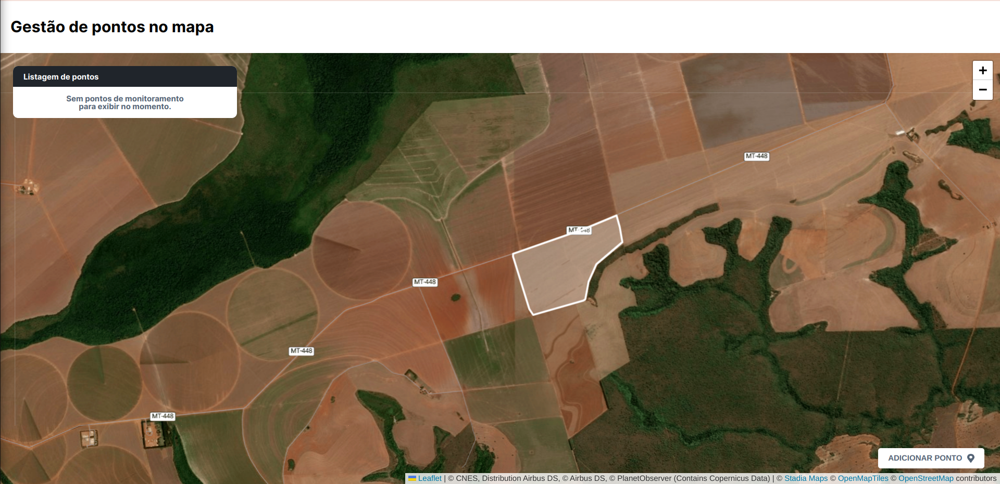
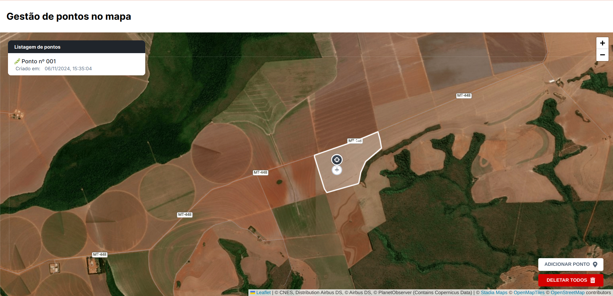
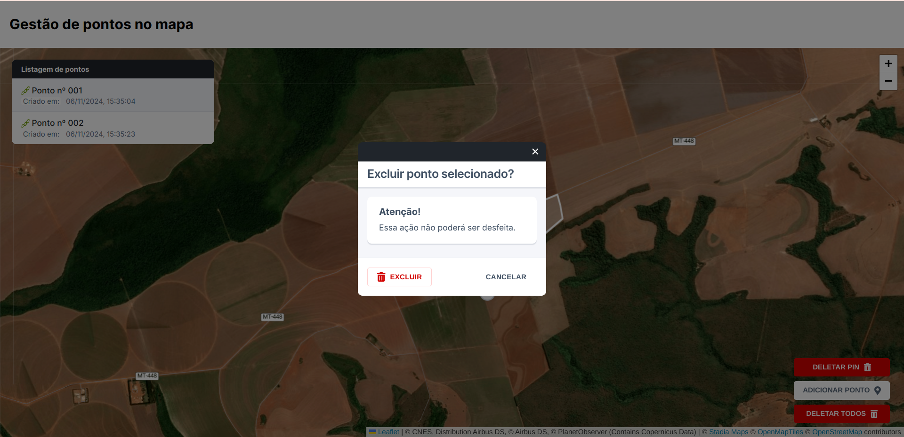
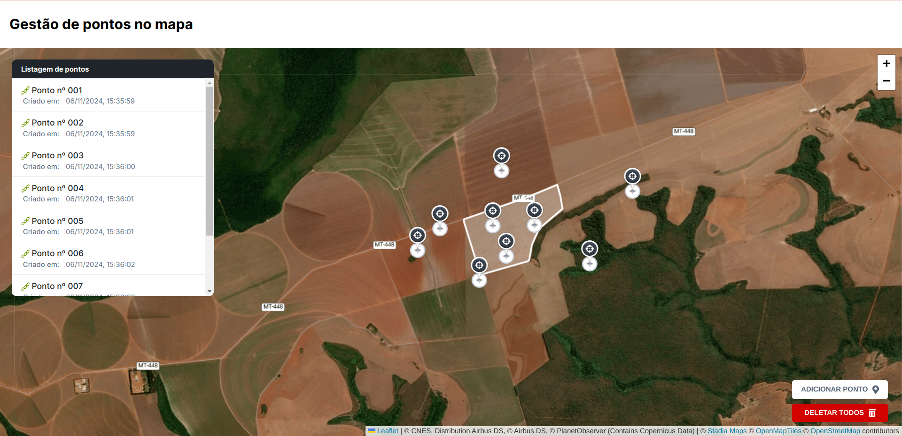

# Field Marker

This is a field marker APP built using [React.js](https://react.dev/), [Vite](https://vitejs.dev/), [Typescript](https://www.typescriptlang.org/) and [Leaflet](https://leafletjs.com/reference.html).

## Prerequisites

- Node
- Npm 

## Installation

1. Clone the repository:

    ```bash
    git clone https://github.com/ingridflack/field-marker.git
    ```
2. Install the dependencies:
    ```bash
    npm install
    ```    
4. Run `npm run dev` to build and run the app
5. Run `npm run test` to run unit tests

## Features

1. The producer must be able to add points to the map.
2. The producer must be able to know the order in which points were created on the map.
3. The producer must be able to know when each point on the map was created.
4. The producer must be able to move points added to the map.
5. The producer must be able to remove a point from the map.
6. The producer must be able to delete all points from the map






